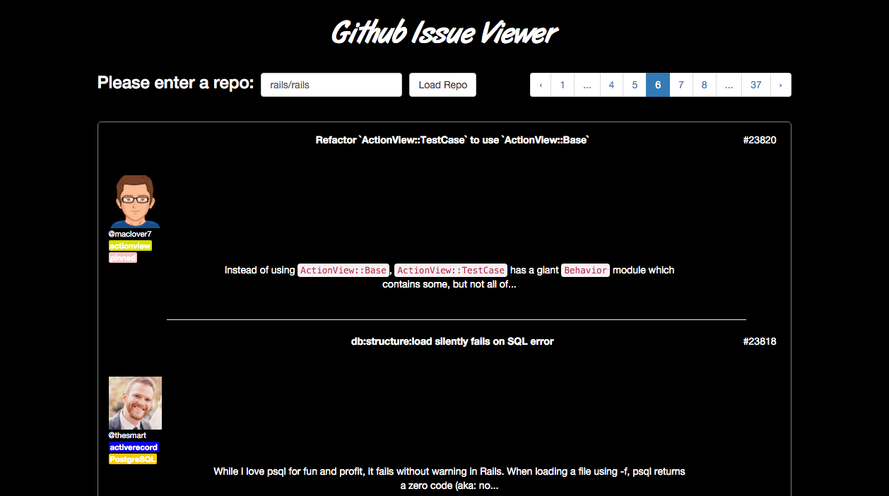
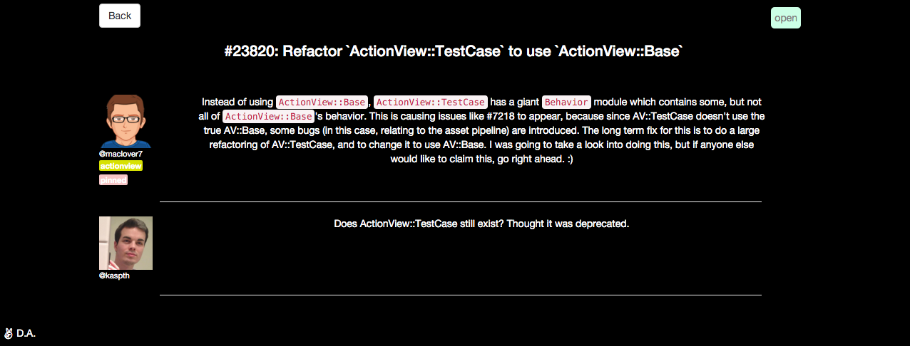

# Github Issue Viewer

This is a viewer for Github repository issues built with [Angular 1.4.9](https://angularjs.org/).

Requests sent to the Github API are anonymous and **cap out at 60 requests per hour**. If nothing appears and a 404 error is given in the console, you have capped out the API and the app will not work.

## Installing dependencies
Some dependencies need to be installed before the app can run properly. In your command line, navigate to the issue_viewer directory and run
```
$ npm install
```
## Running the app
The app can be run from a local server of your choice. For example, if you have python 3.x installed on your system, locate the issue_viewer/app folder on your terminal and run the command 
```
$ python -m http.server
```
Using this option will have the app run on your IP address with a default port of 8000. For example:

http://10.36.202.220:8000/

An alternative is to locate the issue_viewer/app folder and use the npm start command below.
```
$ npm start
```
Using this local server option will have the app run at http://localhost:**8000**/app/#/

**The port number in bold will be given in the command line and may not be the same as above.
## Screenshots




## Tools Used

- [Angular](https://angularjs.org/) for views and routing
    - [ngSanitizer](https://github.com/angular/bower-angular-sanitize) - Sanitize HTML
    - [ngRoute](https://docs.angularjs.org/api/ngRoute) - Used for routing
    - [Showdown](https://github.com/showdownjs/showdown) - Needed for markdown styling
    - [Pagination Directive](https://github.com/michaelbromley/angularUtils/tree/master/src/directives/pagination) - Used for pagination on the home page
- [Bootstrap](http://twbs.github.io/bootstrap) for styling

### Modules
- 'gitIssues' - main app module. Holds the other modules on this list
- 'ngRoute' - routing module. Provides the $routeProvider used for configuring routes
- 'controllers' - module that contains the controllers in use
    - 'defaultController' - controller for the default view
    - 'viewController' - controller for the issue details view
- 'services' - js for services used in the controllers
    - 'getIssueInfo' - retrieve API info used for issue details page
    - 'formatSummary' - filter using the 'truncate' service to trim summaries to 140 characters
    - 'linkGithubAccount' - link @ names in issue summaries/comments to Github accounts
    - 'markdown' - filter summaries to Github Flavored Markdown

### Testing
Testing can be done to check for:
- File patterns
    - Watch - watches for any changes to files
    - Tracks whether files should be included. If true, files will be directly included in the browser using a script tag
To run tests, navigate to the issue_viewer directory and enter the command
```
$ npm test
```
Test results will populate in the command line and can also be viewed by the HTML file reporter, which creates a visual representation of the test results that can be viewed at issue_viewer/test/unit.html. 

The app was tested in various browser environments to ensure proper translation for users. Some users were asked to partake in a survey to further assess the issue viewer and some notes drawn from the survey are as follows:
- "Smooth navigation between pages"
- "Nice to have an option to go straight to the first or last page"
- "Better optimization for mobile would be nice"
- "Simple, but clean. A feature to search through Github repos for issues would be nice" 

### Future Ideas
- Incorporate input for searching and receiving issues from a repository of your choice (implementation was started, but not finished)
- Further testing with Karma/Jasmine
- Optimization for mobile